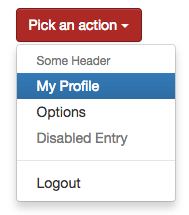

# Dropdowns

## Description
`bootstrap.dropdown(text, items, btnClass, isDropup)`

| Field     | Type    | Description                                        |
|:----------|:-------:|:---------------------------------------------------|
| text      | string  | The text of the dropdown button                    |
| items     | array   | Array of [Dropdown Item](./types.md#dropdown-item) |
| btnClass  | string  | The class for the Button                           |
| isDropup  | boolean | If true, the menu will be open upwards             |

## Example
```twig
{{ bootstrap.dropdown('Pick an action', [
    'Some Header',
    {href: '#', text: 'My Profile', active: true},
    {href: '#', text: 'Options'},
    {href: '#', text: 'Disabled Entry', disabled: true},
    'separator',
    {href: '#', text: 'Logout'}
], 'btn-danger', false) }}
```
