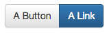
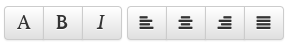

[← 1. Dropdowns](./01_dropdowns.md) | [Return to index](index.md) | [3. Button Dropdown →](./03_button_dropdowns.md)

---

# Button Group / Button Toolbar

## Button Group

### Description
`bootstrap.buttonGroup(items)`

| Field          | Type    | Description                                                |
|:---------------|:-------:|:-----------------------------------------------------------|
| items          | array   | Array of [Button Element](./types.md#button-element)       |

### Example
```twig
{{ bootstrap.buttonGroup([
    {text: 'A Button', attr: {'ID': 'myButton1', 'onclick': 'alert(\'Hello World\')'}},
    {text: 'A Link', href: '#', class: 'btn-primary'},
]) }}
```


## Button Toolbar
## Description
`bootstrap.buttonToolbar(groups)`

| Field          | Type    | Description                       |
|:---------------|:-------:|:----------------------------------|
| items          | array   | An array of `bootstrap.buttonGroup()`-items |

### Example
```twig
{{ bootstrap.buttonToolbar([
    [
        {href: '#', text: '<i class="glyphicon glyphicon-font"></i>'},
        {href: '#', text: '<i class="glyphicon glyphicon-bold"></i>'},
        {href: '#', text: '<i class="glyphicon glyphicon-italic"></i>'},
    ],
    [
        {href: '#', text: '<i class="glyphicon glyphicon-align-left"></i>'},
        {href: '#', text: '<i class="glyphicon glyphicon-align-center"></i>'},
        {href: '#', text: '<i class="glyphicon glyphicon-align-right"></i>'},
        {href: '#', text: '<i class="glyphicon glyphicon-align-justify"></i>'}
    ]
]) }}
```


---

[← 1. Dropdowns](./01_dropdowns.md) | [Return to index](index.md) | [3. Button Dropdown →](./03_button_dropdowns.md)