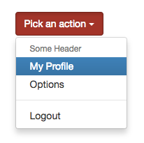
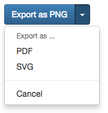

# Button Dropdowns

## Single Button Dropdowns
### Description
`bootstrap.singleButtonDropdown(text, items, btnClass, isDropup)`

| Field     | Type       | Description                                             |
|:----------|:----------:|:--------------------------------------------------------|
| button    | dictionary | Instance of [Button Element](./types.md#button-element) |
| items     | array      | Array of [Dropdown Item](./types.md#dropdown-item)      |
| isDropup  | boolean    | If true, the menu will be open upwards                  |

### Example
```twig
{{ bootstrap.singleButtonDropdown({text: 'Pick an action', class: 'btn-danger'}, [
    'Some Header',
    {href: '#', text: 'My Profile', active: true},
    {href: '#', text: 'Options'},
    'separator',
    {href: '#', text: 'Logout'}
], false) }}
```


## Split Button Dropdowns
### Description
`bootstrap.splitButtonDropdown(text, items, btnClass, isDropup)`

| Field     | Type       | Description                                             |
|:----------|:----------:|:--------------------------------------------------------|
| button    | dictionary | Instance of [Button Element](./types.md#button-element) |
| items     | array      | Array of [Dropdown Item](./types.md#dropdown-item)      |
| isDropup  | boolean    | If true, the menu will be open upwards                  |

### Example
```twig
{{ bootstrap.splitButtonDropdown({text: 'Export as PNG', class: 'btn-primary'}, [
    'Export as ...',
    {href: '#', text: 'PDF'},
    {href: '#', text: 'SVG'},
    'separator',
    {href: '#', text: 'Cancel'}
], false) }}
```
