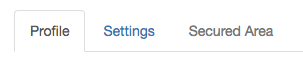
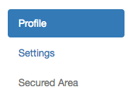

[← 3. Button Dropdown](./03_button_dropdowns.md) | [Return to index](index.md) | [5. Breadcrumbs →](./05_breadcrumbs.md)

---

# Navs

## Tabs
### Description
`bootstrap.tabs(items)`

| Field       | Type       | Description                                             |
|:------------|:----------:|:--------------------------------------------------------|
| items       | array      | Array of [Nav Item](./types.md#nav-item)                |
| isJustified | boolean    | If true, the nav width equal widths of their parent     |

### Example
```twig
{{ bootstrap.tabs([
    {href: '#', text: 'Profile', active: true},
    {href: '#', text: 'Settings'},
    {href: '#', text: 'Secured Area', disabled: true}
]) }}
```


## Pills
### Description
`bootstrap.pills(items, isStacked)`

| Field       | Type       | Description                                             |
|:------------|:----------:|:--------------------------------------------------------|
| items       | array      | Array of [Nav Item](./types.md#nav-item)                |
| isJustified | boolean    | If true, the nav width equal widths of their parent     |
| isStacked   | boolean    | If true, the nav will be stacked                        |

### Example
```twig
{{ bootstrap.pills([
    {href: '#', text: 'Profile', active: true},
    {href: '#', text: 'Settings'},
    {href: '#', text: 'Secured Area', disabled: true}
], false, true) }}
```


---

[← 3. Button Dropdown](./03_button_dropdowns.md) | [Return to index](index.md) | [5. Breadcrumbs →](./05_breadcrumbs.md)