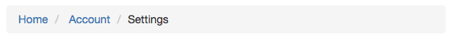

[← 4. Navs](./04_navs.md) | [Return to index](index.md)

---

# Breadcrumbs
## Description
`bootstrap.breadcrumbs(items)`

| Field       | Type       | Description                                             |
|:------------|:----------:|:--------------------------------------------------------|
| items       | array      | Array of [Link](./types.md#link)                        |

## Example
```twig
{{ bootstrap.breadcrumbs([
    {href: '#', text: 'Home'},
    {href: '#', text: 'Account'},
    {href: '#', text: 'Settings'}
], true) }}
```


---

[← 4. Navs](./04_navs.md) | [Return to index](index.md)