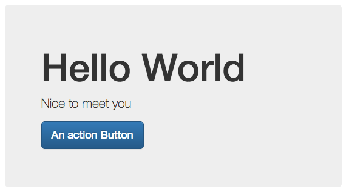

[← 5. Breadcrumbs](./05_breadcrumbs.md) | [Return to index](index.md) | [7. Page Header →](./07_page_header.md)

---

# Jumbotron
## Description
`bootstrap.jumbotron(heading, paragraphs, actionButton)`

| Field        | Type       | Description                                             |
|:-------------|:----------:|:--------------------------------------------------------|
| heading      | string     | The heading of the jumbotron                            |
| paragraphs   | array      | Array of string; Jumbotron Content                      |
| actionButton | dictionary | Instance of [Button Element](./types.md#button-element) |

## Example
```twig
{{ bootstrap.jumbotron(
    'Hello World',
    ['Nice to meet you'],
    {
        text: 'An action Button',
        class: 'btn-primary'
    })
}}
```


---

[← 5. Breadcrumbs](./05_breadcrumbs.md) | [Return to index](index.md) | [7. Page Header →](./07_page_header.md)